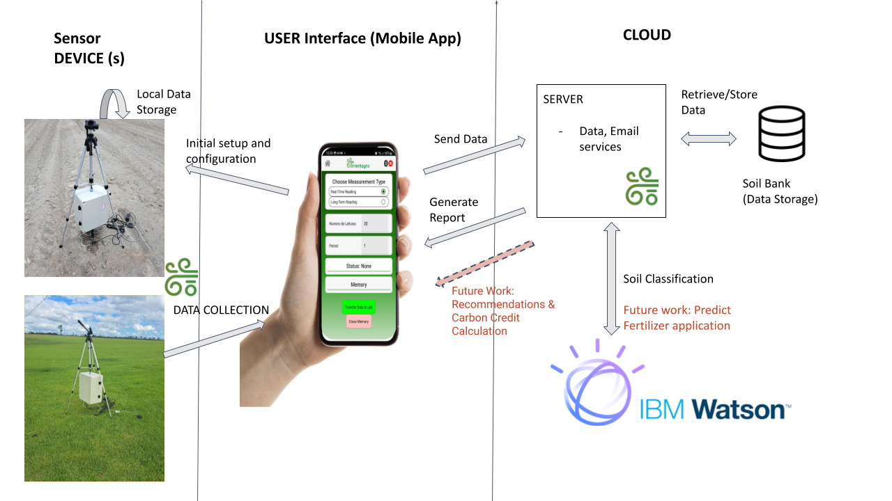

 

_INSTRUCTIONS: This GitHub repository serves as a template you can use to create a new project for the [2023 Call for Code Global Challenge](https://developer.ibm.com/callforcode/global-challenge/). Use the **Use this template** button to create a new version of this repository and start entering content for your own Call for Code submission project. Make sure you have [registered for the 2023 Call for Code Global Challenge](https://developer.ibm.com/callforcode/global-challenge/register/) to access resources and full project submission instructions. Remove any "INSTRUCTIONS" sections when you are ready to submit your project._

_New to Git and GitHub? This free online course will get you up to speed quickly: [Getting Started with Git and GitHub](https://www.coursera.org/learn/getting-started-with-git-and-github)_.

# Replace this heading with your team/submission name

- [Project summary](#project-summary)
  - [The issue we are hoping to solve](#the-issue-we-are-hoping-to-solve)
  - [How our technology solution can help](#how-our-technology-solution-can-help)
  - [Our idea](#our-idea)
- [Technology implementation](#technology-implementation)
  - [IBM AI service(s) used](#ibm-ai-services-used)
  - [Other IBM technology used](#other-ibm-technology-used)
  - [Solution architecture](#solution-architecture)
- [Presentation materials](#presentation-materials)
  - [Solution demo video](#solution-demo-video)
  - [Project development roadmap](#project-development-roadmap)
- [Additional details](#additional-details)
  - [How to run the project](#how-to-run-the-project)
  - [Live demo](#live-demo)
- [About this template](#about-this-template)
  - [Contributing](#contributing)
  - [Versioning](#versioning)
  - [Authors](#authors)
  - [License](#license)
  - [Acknowledgments](#acknowledgments)

_INSTRUCTIONS: Complete all required deliverable sections below._

## Project summary

### The issue we are hoping to solve

Orientagro aims to tackle the inefficiencies and environmental impact of traditional soil and gas emission management in agriculture. By providing real-time data on soil conditions and greenhouse gas emissions like nitrous oxide, methane, and CO2, we aspire to promote sustainable farming practices and contribute to climate change mitigation. This will allow farmers to optimize their use of resources like water and fertilizers, thus improving productivity while reducing environmental harm.

### How our technology solution can help

OrientAgro's AI-powered portable sensors offer real-time soil and gas emission analysis for sustainable agriculture.

### Our idea

OrientAgro is confronting the pressing challenges in agricultural practices in both the United States and Brazil, focusing primarily on the harmful emissions of greenhouse gases like nitrous oxide (N2O), methane, and CO2. These emissions, largely arising from the use of nitrogen-based fertilizers, are significant contributors to both ozone depletion and global warming. Traditional soil analysis methods further compound the problem. They are not only slow and costly but also environmentally hazardous, relying on external labs that use harmful reagents.

Our solution revolutionizes this status quo with a portable, AI-powered sensor system that offers real-time, accurate monitoring of soil conditions and greenhouse gas emissions. Integrated with IBM Watson Machine Learning, the system includes a variety of soil and gas sensors. Unlike traditional methods that depend on manual, lab-based processes, our technology leverages artificial intelligence to classify soil types, calibrate sensor data, and offer actionable insights. This drastically shortens the time needed for soil analysis, enhances the reliability of the data, and ultimately allows for quicker, more informed farming decisions.

Moreover, our use of AI extends beyond immediate sensor calibration. We are working towards employing machine learning algorithms to offer precise recommendations about fertilizer application. This not only has the potential to reduce the resource cost but also to minimize greenhouse gas emissions. This additional layer of AI-enabled smart decision-making opens avenues for more efficient and environmentally-friendly farming practices.

Importantly, we've validated our technology's feasibility for integration into the carbon credit market. By offering real-time, verified data, our product serves as a credible source for carbon credit assessments. This adds an economic incentive for farmers to adopt our technology, integrating OrientAgro into a larger ecosystem aimed at sustainability and climate resilience.

In summary, OrientAgro offers a holistic, AI-powered solution to address both the environmental and operational inefficiencies in current agricultural practices. By providing real-time data and actionable insights, we're not just improving soil and emission management but also contributing significantly to climate change mitigation efforts. Our technology promises a paradigm shift towards more responsible and efficient farming practices, not just in Brazil and the United States but also globally, making substantial contributions to mitigating climate change and environmental degradation.

## Technology implementation

### IBM AI service(s) used

- [Watson Machine Learning](https://cloud.ibm.com/catalog/services/watson-machine-learning) - IBM Watson Machine Learning is integrated into our solution to enhance the accuracy and reliability of the data collected by our soil and gas sensors. Given the limitations of sensor availability and their varying degrees of precision, Watson's machine learning algorithms are crucial in bridging the gaps. Firstly, we use Watson Machine Learning to classify soil types based on the data collected from our sensors and validated against our growing soil bank, developed in partnership with entities in Brazil. This classification serves as a basis to adjust and correct sensor measurements, enhancing their reliability. It allows us to calibrate the data and estimate the values of soil variables that our sensors are not equipped to measure directly. Secondly, the AutoML feature within IBM Watson assists us in feature selection, helping to identify which sensors are most critical for accurate soil classification. This not only improves the performance of our monitoring system but also has the potential to reduce costs. By identifying less impactful sensors, we can streamline our hardware, making the solution more cost-effective without sacrificing quality. By employing IBM Watson Machine Learning, we can deliver a more accurate, efficient, and cost-effective solution for monitoring soil health and gas emissions, thereby contributing to sustainable agricultural practices.

### Other IBM technology used

In addition to leveraging IBM Watson Machine Learning for data analytics and decision-making, we are in the process of migrating our existing data storage solutions to IBM Cloud Object Storage. This transition aims to provide a more scalable, secure, and cost-effective storage solution, ensuring that our expanding datasets can be efficiently managed and accessed. 

### Solution architecture

Diagram and step-by-step description of the flow of our solution:

1. Initial Setup: The user positions the device in the designated area of the farm for monitoring, replacing traditional manual soil analysis done by agronomists.
2. Data Collection Configuration: Using the mobile app, the user selects between real-time monitoring or schedules a specific time for data collection (e.g., 15-minute intervals for each portion of the farm).
3. Sensor Activation: The device begins collecting data on variables such as NPK (Nitrogen, Phosphorus, Potassium), CO2, N2O, and other soil and gas conditions. 
The device features local data storage, which can also be removed.
4. Bluetooth Connectivity: Users connect to the device via Bluetooth through the mobile app, enabling real-time data visualization. This allows for comparative analysis between different farm regions, specifically concerning gas emissions. Bluetooth was chosen due to limited internet accessibility in many Brazilian farms.
5. Data Transmission: On pressing the 'Generate Report' button on the interface, all collected data is sent to the server.
6. IBM Watson Machine Learning: Data reaches the server, where WatsonX Machine Learning processes it to classify the soil type and returns this classification to our service.
7. Data Calibration: Based on the classified soil type, our server adjusts the sensor data and estimates values for unmeasured variables using our soil bank.
8. Report Generation: A comprehensive soil analysis report is generated, sent to the user's email, and also displayed on the mobile app.
9. Future Work: The system will offer actionable suggestions based on the collected data, such as optimizing fertilizer use depending on soil conditions. It will also allow users to track N2O emissions for potential conversion into carbon credits.

## Presentation materials

_INSTRUCTIONS: The following deliverables should be officially posted to your My Team > Submissions section of the [Call for Code Global Challenge resources site](https://cfc-prod.skillsnetwork.site/), but you can also include them here for completeness. Replace the examples seen here with your own deliverable links._

### Solution demo video

### Project development roadmap

The project currently does the following things.

- Feature 1
- Feature 2
- Feature 3

In the future we plan to...

See below for our proposed schedule on next steps after Call for Code 2023 submission.

## Additional details

_INSTRUCTIONS: The following deliverables are suggested, but **optional**. Additional details like this can help the judges better review your solution. Remove any sections you are not using._

### How to run the project

INSTRUCTIONS: In this section you add the instructions to run your project on your local machine for development and testing purposes. You can also add instructions on how to deploy the project in production.

### Live demo

You can find a running system to test at...

See our [description document](./docs/DESCRIPTION.md) for log in credentials.

---

_INSTRUCTIONS: You can remove the below section from your specific project README._

## About this template

### Contributing

Please read [CONTRIBUTING.md](CONTRIBUTING.md) for details on our code of conduct, and the process for submitting pull requests to us.

### Versioning

We use [SemVer](http://semver.org/) for versioning. For the versions available, see the [tags on this repository](https://github.com/your/project/tags).

### Authors

- **Billie Thompson** - _Initial work_ - [PurpleBooth](https://github.com/PurpleBooth)

### License

This project is licensed under the Apache 2 License - see the [LICENSE](LICENSE) file for details.

### Acknowledgments

- Based on [Billie Thompson's README template](https://gist.github.com/PurpleBooth/109311bb0361f32d87a2).
